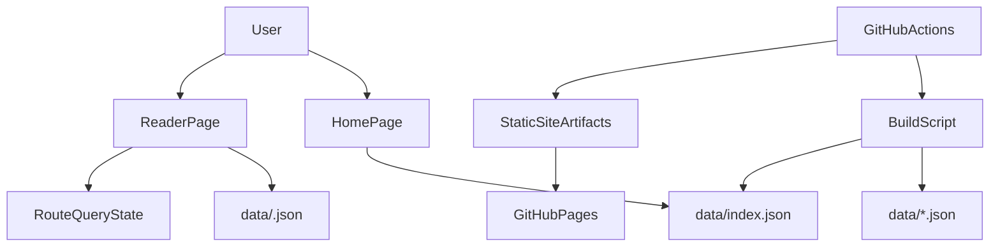
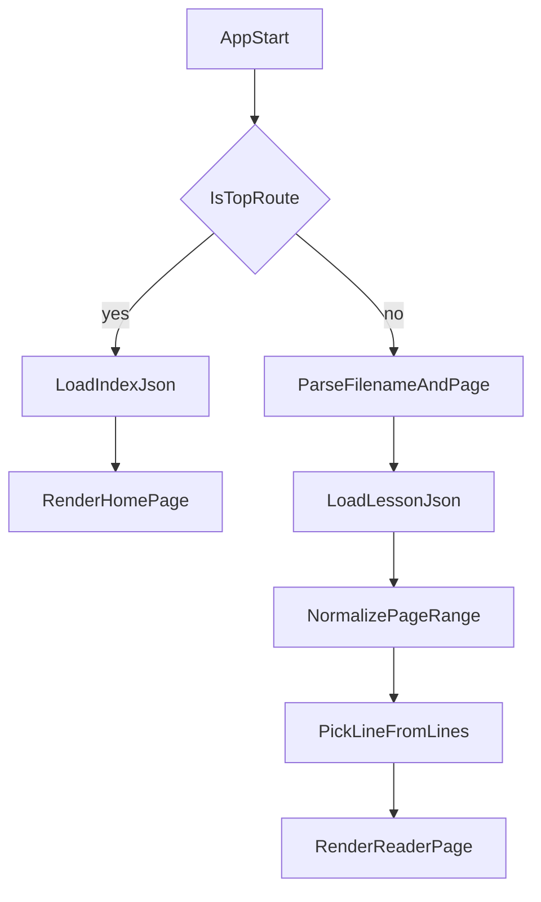
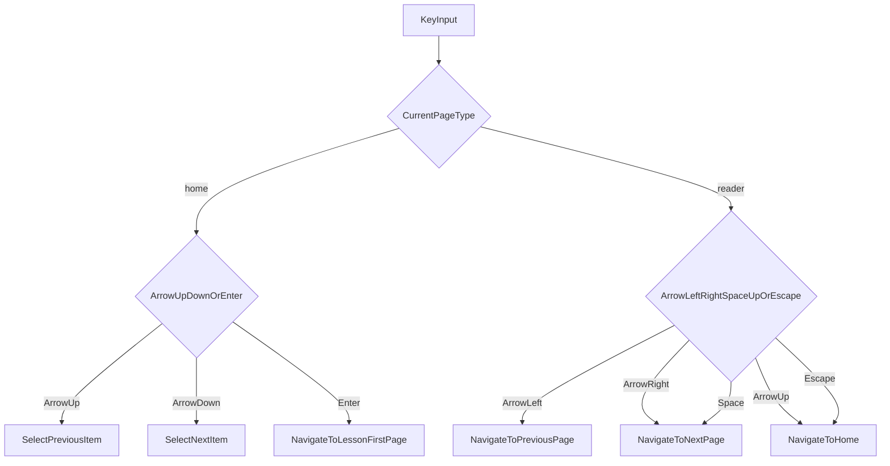
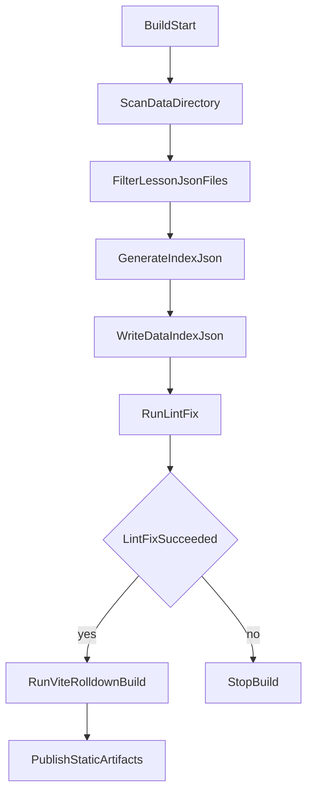

# Architecture

## 目的

このアプリケーションは、シャドーイング教材を 1 行ずつ表示し、キーボード主体でテンポ良く学習できるようにすることを目的とする。教材は静的な JSON ファイルとして管理し、アプリ全体も静的サイトとして配信する。

## 設計原則

- 単機能アプリとして構成し、複雑なサーバーサイド機能は持たない
- Nuxt は使わず、Vue + Vite Rolldown + Vuetify で構築する
- 教材データはリポジトリ管理下の静的ファイルとして扱う
- URL を状態の正本とし、ページ位置を `?page=` で表現する
- キーボード操作だけで主要な導線を完結できるようにする
- ESLint ルールは Nuxt 4 標準を規約として援用する

## システム全体像



## 画面構成

### 1. HomePage

トップページの責務は教材一覧の表示と選択である。

- `data/index.json` を読み込み、教材一覧を表示する
- 各教材の `title` と `description` を一覧上の表示に利用する
- 現在選択中の教材を内部状態として保持する
- `ArrowUp` / `ArrowDown` で選択を移動する
- `Enter` で選択中教材の先頭ページへ遷移する

### 2. ReaderPage

教材ページの責務は、選択された教材の 1 行を現在ページとして描画することである。

- ルートパラメータから `filename` を取得する
- クエリから `page` を取得し、現在ページ番号として解釈する
- 対応する JSON ファイルを読み込む
- `lines` 配列の該当要素を HTML として表示する
- 学習時の視界を保つため、`title` と `description` は表示しない
- `ArrowLeft` / `ArrowRight` で前後ページへ移動する
- `Space` でも次ページへ移動する
- `ArrowUp` または `Escape` でトップページへ戻る

トップページと教材ページは、Vue 的には別コンポーネントとして分離する。

## データ設計

### 教材ファイル

- 保存場所: `data/<filename>.json`
- 形式: メタ情報と本文行を持つ JSON オブジェクト
- 意味:
  - `title`: トップページで表示する教材名
  - `description`: トップページで表示する教材説明
  - `lines`: 各配列要素が 1 ページ分の表示内容

例:

```json
{
  "title": "Skit 2026 Spring",
  "description": "sample",
  "lines": [
    "Prima riga",
    "<b>Seconda riga</b>",
    "Terza riga"
  ]
}
```

### 一覧ファイル

- 保存場所: `data/index.json`
- 役割: トップページで表示する教材一覧の正本
- 更新方式: ビルド前またはビルド時に `data/` を走査して再生成する

`data/index.json` には最低限、教材ファイル名の一覧が必要である。トップページで `title` / `description` を使うため、実装では一覧ファイルに表示用メタ情報を持たせるか、各教材ファイルを読んで集約するかを選べる。初期方針としては、ビルド時に `data/index.json` へ表示用メタ情報も含める構成が扱いやすい。

## ルーティングと状態管理

URL をそのまま画面状態として利用する。

- `/`
  - 教材一覧を表示する
- `/<filename>`
  - `page` 未指定時は先頭ページを表示する
- `/<filename>?page=<page>`
  - 指定ページを表示する

内部では次のように状態を解釈する。

- `filename`
  - 表示対象教材を識別する
- `page`
  - `lines` 配列インデックスに対応する表示位置
  - 未指定時は 0 扱い
  - 負数、非数値、範囲外は有効範囲へ補正する

この設計により、ブラウザ再読み込みや URL 共有時にも同じ教材・同じページを再現できる。

## 表示責務

教材データの `lines` に含まれる各文字列は HTML として描画する。`<b>` などの軽い装飾を前提にしているため、プレーンテキストではなく HTML 出力が必要になる。

そのため、設計上は次の前提を置く。

- 入力データはユーザー投稿ではなく、リポジトリ管理下の信頼済み教材とする
- HTML の許容範囲は教材記述に必要な最小限を想定する
- 表示用スタイルは各 `.vue` 内で定義する
- ReaderPage では学習に不要なメタ情報を表示しない

## 処理フロー

### 起動から表示ページ決定まで



### キー入力から画面遷移まで



### ビルド時の教材一覧更新



## ビルドと配備

### ビルド

- `package.json` に `lint` と `lint-fix` の npm スクリプトを定義する
- `lint` は ESLint による静的検査を行う
- `lint-fix` は ESLint による自動修正とフォーマットを行う
- ESLint ルールセットは Nuxt 4 標準をベースにする
- Vite Rolldown でアプリをビルドする
- ビルド前に `data/` を走査し、`data/index.json` を更新する
- ビルドプロセス内で `lint-fix` を実行し、整形済み状態で成果物を生成する
- `lint-fix` 実行後もエラーが残る場合は、Vite ビルドへ進まずに処理を失敗終了とする
- 出力物は静的ファイルとして生成する

### 配備

- GitHub Actions でビルドを自動実行する
- 生成された静的ファイルを GitHub Pages に配置する
- 実行時に必要なサーバー処理は持たない

## 主要な責務分割

- `HomePage`
  - 教材一覧取得
  - `title` / `description` 表示
  - 選択状態管理
  - 一覧上のキー操作
- `ReaderPage`
  - 教材取得
  - ページ番号補正
  - `lines` の HTML 描画
  - メタ情報の非表示制御
  - 読書中のキー操作
- ルーター
  - `filename` と `page` の解釈
  - URL 更新による状態遷移
- ビルドスクリプト
  - `data/` 走査
  - `data/index.json` 更新
  - `lint-fix` 実行
  - `lint-fix` 失敗時のビルド停止
  - Vite ビルド起動
- GitHub Actions
  - ビルドと GitHub Pages 公開

## 今後の実装時に意識する点

- ページ範囲外の移動時の挙動を明確にする
- キー操作がフォーム要素と競合しないようにする
- HTML 描画は信頼済みデータを前提にしつつ、データ投入経路を限定する
- トップページの選択状態を視覚的に分かりやすくする
- 一覧用メタ情報と本文表示責務を混在させない
- `lint-fix` をビルドに組み込むため、ローカル開発時との差分が出にくい運用にする
