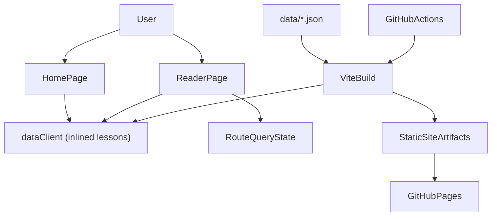
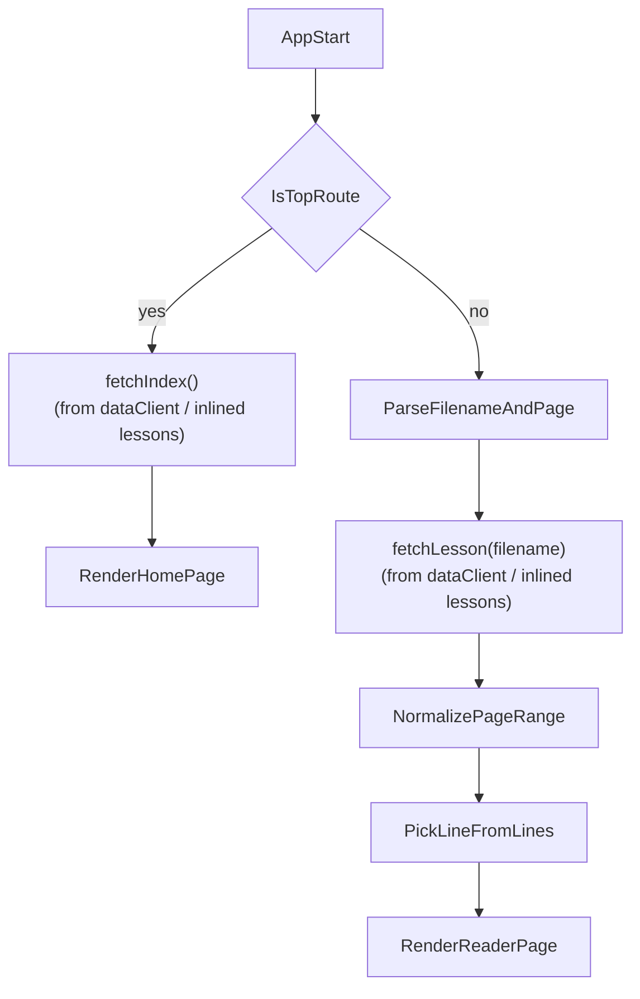
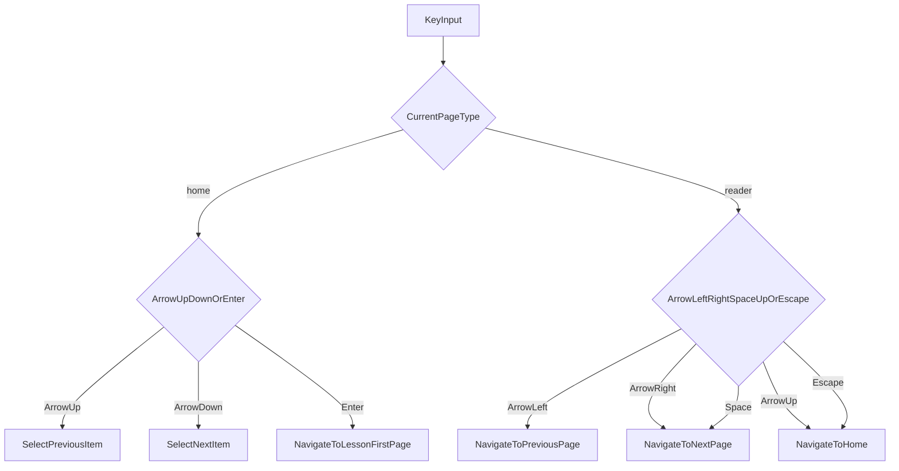
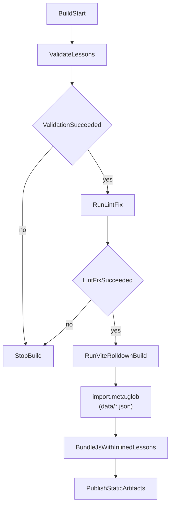

# Architecture

このファイルは Italy Shadowing の**現状の内部設計**をまとめたものです。要件の発端は [`Plan.md`](Plan.md) (初期プランニングメモ) に残してあります。ユーザー向けの機能・データ形式・キーボード操作は [`../README.md`](../README.md)、開発・ビルド手順は [`Development.md`](Development.md)、デプロイ手順は [`Deployment.md`](Deployment.md)、個別の実装判断は `ADR-*.md` を参照してください。

## 目的

このアプリケーションは、シャドーイング教材を 1 行ずつ表示し、キーボード主体でテンポ良く学習できるようにすることを目的とする。教材は静的な JSON ファイルとして管理し、アプリ全体も静的サイトとして配信する。

## 設計原則

- 単機能アプリとして構成し、複雑なサーバーサイド機能は持たない
- Nuxt は使わず、Vue + Vite Rolldown + Vuetify で構築する
- 教材データはリポジトリ管理下の静的ファイルとして扱う
- URL を状態の正本とし、ページ位置を `?page=` で表現する
- キーボード操作だけで主要な導線を完結できるようにする
- ESLint ルールは Nuxt 4 標準を規約として援用する

## システム全体像



教材 JSON は `import.meta.glob({ eager: true })` により Vite の build / dev で JS バンドルへ inline される。runtime fetch は発生せず、HomePage / ReaderPage は `src/lib/dataClient.js` の `fetchIndex()` / `fetchLesson()` を介して inline 済みのデータを参照する。

## 画面構成

### 1. HomePage

トップページの責務は教材一覧の表示と選択である。

- `src/lib/dataClient.js` の `fetchIndex()` を呼び、JS バンドルへ inline 済みの教材データから `[{ filename, title, description }]` 一覧を取得する (runtime fetch なし)
- 各教材の `title` と `description` を一覧上の表示に利用する
- 現在選択中の教材を内部状態として保持する
- `ArrowUp` / `ArrowDown` で選択を移動する
- `Enter` で選択中教材の先頭ページへ遷移する

### 2. ReaderPage

教材ページの責務は、選択された教材の 1 行を現在ページとして描画することである。

- ルートパラメータから `filename` を取得する
- クエリから `page` を取得し、現在ページ番号として解釈する
- `src/lib/dataClient.js` の `fetchLesson(filename)` を呼び、JS バンドルへ inline 済みの該当教材データを取得する (runtime fetch なし)
- `lines` 配列の該当要素を HTML として表示する
- 学習時の視界を保つため、`title` と `description` は表示しない
- `ArrowLeft` / `ArrowRight` で前後ページへ移動する
- `Space` でも次ページへ移動する
- `ArrowUp` または `Escape` でトップページへ戻る
- `Enter` で音声の再生 / 一時停止、`ArrowDown` でリピートモードを循環する (オフ → 全体 → 現在ページ → オフ。音声機能は下記)

トップページと教材ページは、Vue 的には別コンポーネントとして分離する。

### 3. 音声再生と自動ページめくり

教材ごとの MP3 音声はユーザーが端末内へ読み込み、IndexedDB に保存する (リポジトリにはコミットしない。決定の背景: ADR-007)。行頭タイミング (キュー) はアプリ内の記録モードで作成し localStorage に保存する。責務は次のように分割する。

- `src/lib/audioStore.js` — IndexedDB への MP3 Blob の get / put / delete (throw しない best-effort ラッパー)
- `src/lib/cueStore.js` — キュー (行開始秒の昇順配列) の load / save / delete。load 時に行数一致まで検証し、不一致は「未記録」に落とす
- `src/composables/usePlaybackSpeed.js` — 再生速度 (0.6〜1.0 倍) の singleton 状態と localStorage 永続化 (useFontScale と同型)
- `src/composables/useAudioPlayer.js` — `new Audio()` の所有、object URL の生成/破棄、再生・シーク・ループ・キュー記録の状態機械、および VueUse `useRafFn` による毎フレーム同期。再生位置 + 0.1 秒 (先行めくり) からページ番号を純関数で計算し、ReaderPage の `goToPage` (冪等) を呼ぶ
- `src/components/AudioControlBar.vue` — ReaderPage 下端の操作バー (読み込み / 再生 / シーク / 速度 / リピート循環 / 記録 / 管理)

ページ位置の正本は従来どおり URL (`?page=`) であり、自動ページめくりも `goToPage` → `router.replace` を経由する。ユーザーの手動ページ移動は ReaderPage の `manualGoToPage` に集約し、再生中であれば音声を移動先の行頭へシークする (自動めくりとの違いはこのシークの有無だけ)。

## データ設計

### 教材ファイル

- 保存場所: `data/<filename>.json`
- 形式: メタ情報と本文行を持つ JSON オブジェクト
- 意味:
  - `title`: トップページで表示する教材名
  - `description`: トップページで表示する教材説明
  - `lines`: 各配列要素が 1 ページ分の表示内容

例:

```json
{
  "title": "Skit 2026 Spring",
  "description": "sample",
  "lines": [
    "Prima riga",
    "<b>Seconda riga</b>",
    "Terza riga"
  ]
}
```

### 一覧の組み立て

`data/index.json` のような一覧ファイルは持たない。`src/lib/dataClient.js` が起動時に `import.meta.glob('../../data/*.json', { eager: true })` で全教材ファイルを取得し、各 JSON の `title` / `description` から動的に一覧を組み立てる。これにより:

- リポジトリに 1 ファイル余分にコミットする必要がない (旧 `data/index.json` は撤廃済み)
- 教材追加・削除後に手動で一覧を更新する手間がない
- HomePage 用一覧と本文表示で同じ inline データを共有できる

`data/index.json` を Vite plugin で on-the-fly 生成する旧設計は、`import.meta.glob` による inline 化の採用に伴って撤廃された (関連: ADR-003 改定経緯)。

## ルーティングと状態管理

URL をそのまま画面状態として利用する。

- `/`
  - 教材一覧を表示する
- `/<filename>`
  - `page` 未指定時は先頭ページを表示する
- `/<filename>?page=<page>`
  - 指定ページを表示する

内部では次のように状態を解釈する。

- `filename`
  - 表示対象教材を識別する
- `page`
  - `lines` 配列インデックスに対応する表示位置
  - 未指定時は 0 扱い
  - 負数、非数値、範囲外は有効範囲へ補正する

この設計により、ブラウザ再読み込みや URL 共有時にも同じ教材・同じページを再現できる。

## 表示責務

教材データの `lines` に含まれる各文字列は HTML として描画する。`<b>` などの軽い装飾を前提にしているため、プレーンテキストではなく HTML 出力が必要になる。

そのため、設計上は次の前提を置く。

- 入力データはユーザー投稿ではなく、リポジトリ管理下の信頼済み教材とする
- HTML の許容範囲は教材記述に必要な最小限を想定する
- 表示用スタイルは各 `.vue` 内で定義する
- ReaderPage では学習に不要なメタ情報を表示しない

## 処理フロー

### 起動から表示ページ決定まで



### キー入力から画面遷移まで



### ビルド時の教材取り込み



## ビルドと配備

### ビルド

- `package.json` に `lint` と `lint-fix` の npm スクリプトを定義する
- `lint` は ESLint による静的検査を行う
- `lint-fix` は ESLint による自動修正とフォーマットを行う
- ESLint ルールセットは Nuxt 4 標準をベースにする
- Vite Rolldown でアプリをビルドする
- ビルドプロセスの最初に `validate-lessons` を実行し、教材 JSON のファイル名と構造を fail-loud 検証する
- `validate-lessons` で違反が見つかった場合は、その時点でビルド全体を停止する
- ビルドプロセス内で `lint-fix` を実行し、整形済み状態で成果物を生成する
- `lint-fix` 実行後もエラーが残る場合は、Vite ビルドへ進まずに処理を失敗終了とする
- 教材 JSON は `src/lib/dataClient.js` の `import.meta.glob` を経由して JS バンドルへ inline される (`dist/data/` は生成されない)
- 出力物は静的ファイルとして生成する

### 配備

- GitHub Actions でビルドを自動実行する
- 生成された静的ファイルを GitHub Pages に配置する
- 実行時に必要なサーバー処理は持たない

## 主要な責務分割

- `HomePage`
  - 教材一覧取得
  - `title` / `description` 表示
  - 選択状態管理
  - 一覧上のキー操作
- `ReaderPage`
  - 教材取得
  - ページ番号補正
  - `lines` の HTML 描画
  - メタ情報の非表示制御
  - 読書中のキー操作
  - `useAudioPlayer` の生成と手動ページ移動 (`manualGoToPage`) の集約
- 音声まわり (`src/lib/audioStore.js` / `src/lib/cueStore.js` / `src/composables/useAudioPlayer.js` / `src/composables/usePlaybackSpeed.js` / `src/components/AudioControlBar.vue`)
  - MP3 Blob とキューのデバイスローカル永続化 (ADR-007)
  - 再生・速度・ループ・キュー記録の状態管理
  - 再生位置に同期した自動ページめくり (0.1 秒先行)
- ルーター
  - `filename` と `page` の解釈
  - URL 更新による状態遷移
- ビルドパイプライン (`package.json` の `scripts.build`)
  - `validate-lessons` 実行
  - `validate-lessons` 失敗時のビルド停止
  - `lint-fix` 実行
  - `lint-fix` 失敗時のビルド停止
  - Vite ビルド起動 (`import.meta.glob` で `data/*.json` を JS バンドルへ inline)
- `src/lib/dataClient.js`
  - 起動時に `import.meta.glob` 結果から教材 map を構築
  - ファイル名の fail-loud 検証
  - `fetchIndex()` / `fetchLesson()` の API 提供
- GitHub Actions
  - ビルドと GitHub Pages 公開

## 今後の実装時に意識する点

- ページ範囲外の移動時の挙動を明確にする
- キー操作がフォーム要素と競合しないようにする
- HTML 描画は信頼済みデータを前提にしつつ、データ投入経路を限定する
- トップページの選択状態を視覚的に分かりやすくする
- 一覧用メタ情報と本文表示責務を混在させない
- `lint-fix` をビルドに組み込むため、ローカル開発時との差分が出にくい運用にする
